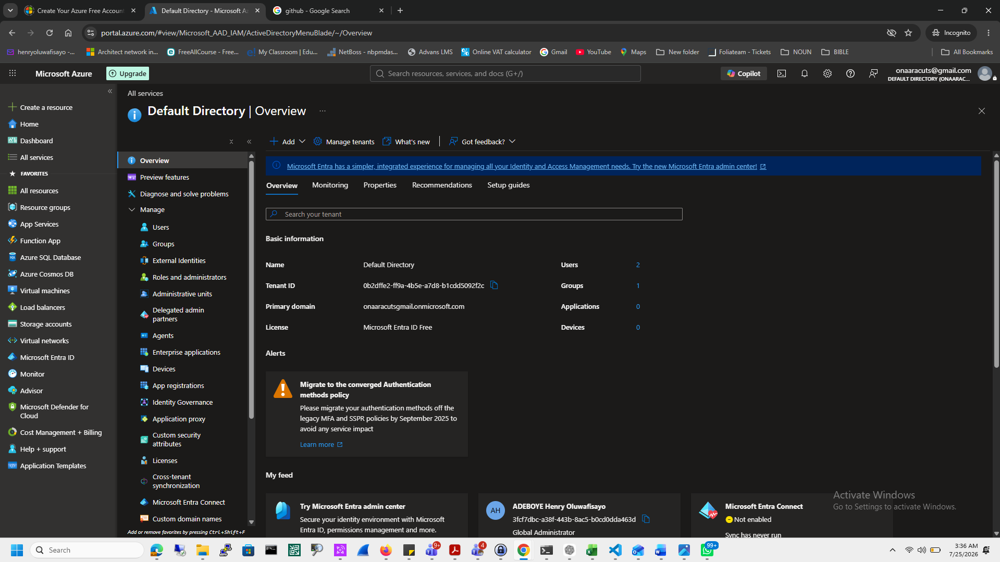
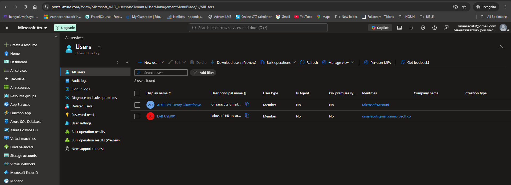
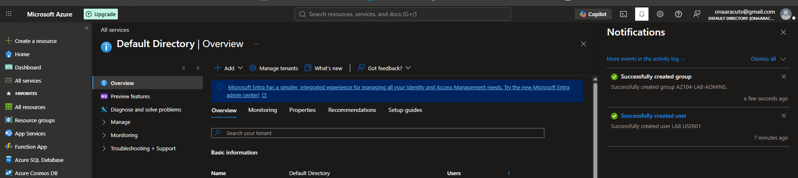
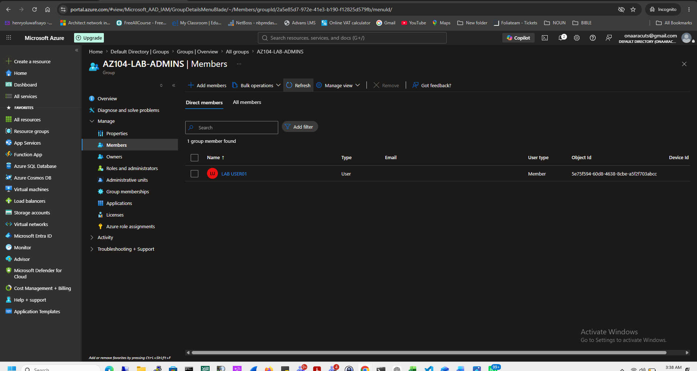
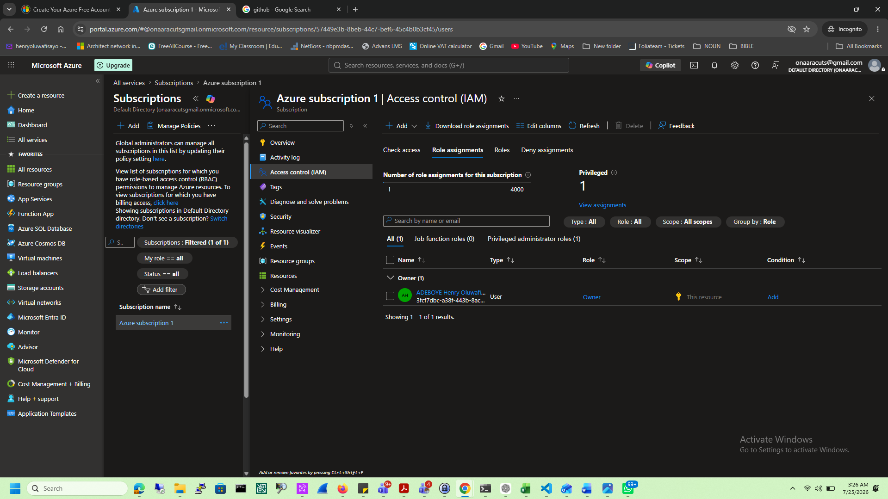

# Microsoft Entra ID

## Objective

Learn how Microsoft Entra ID manages identities and access in Azure.

## Services Used

- Microsoft Entra ID
- Azure RBAC
- Users
- Groups

## Tasks Completed

- Created a cloud user
- Created a security group
- Added user to group
- Explored Azure RBAC

## Lessons Learned

- Microsoft Entra ID is Azure's identity platform.
- Users can be organized into groups for easier permission management.
- RBAC controls access to Azure resources.
- A tenant is the identity boundary, while a subscription is the billing boundary.

## Skills Demonstrated

- Identity Management
- User Administration
- Group Administration
- Azure RBAC

  # Screenshots

## Microsoft Entra ID

---

## User Creation

---

## Group Creation

---

## Group Members

---

## Role Assignment

