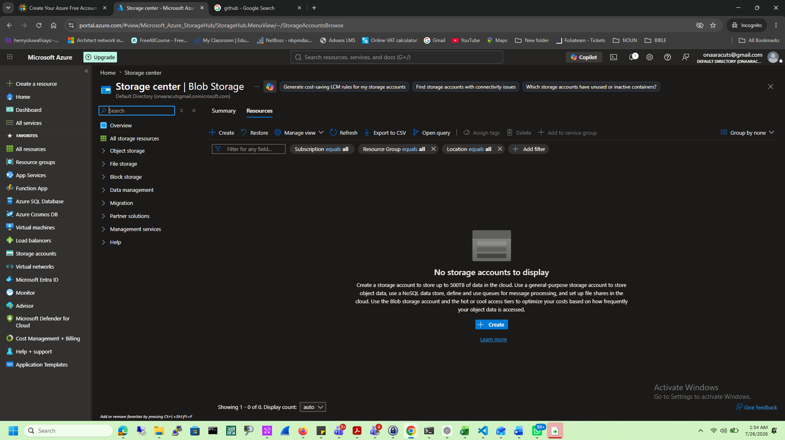
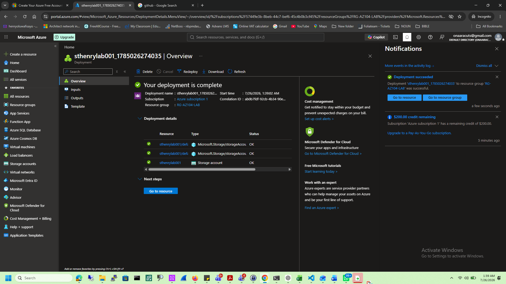
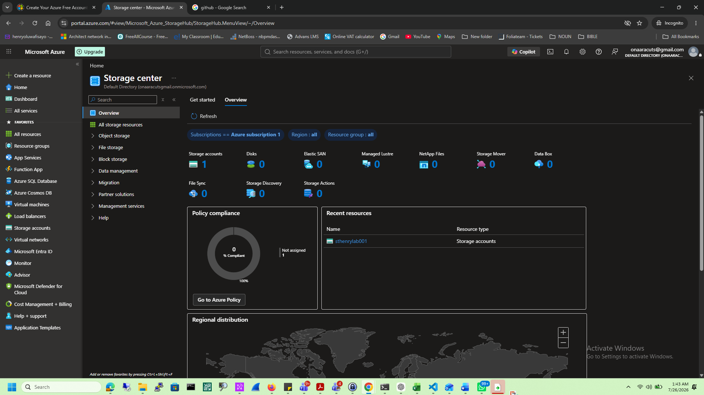
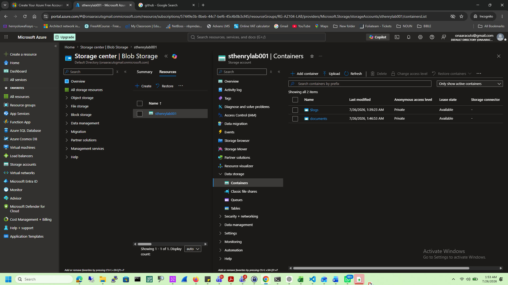
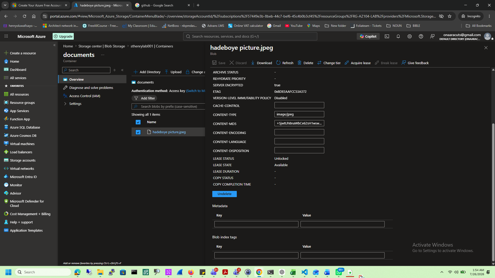
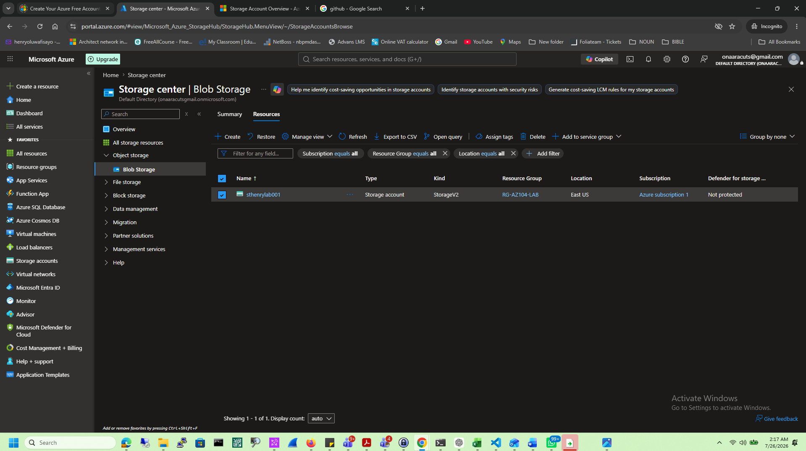
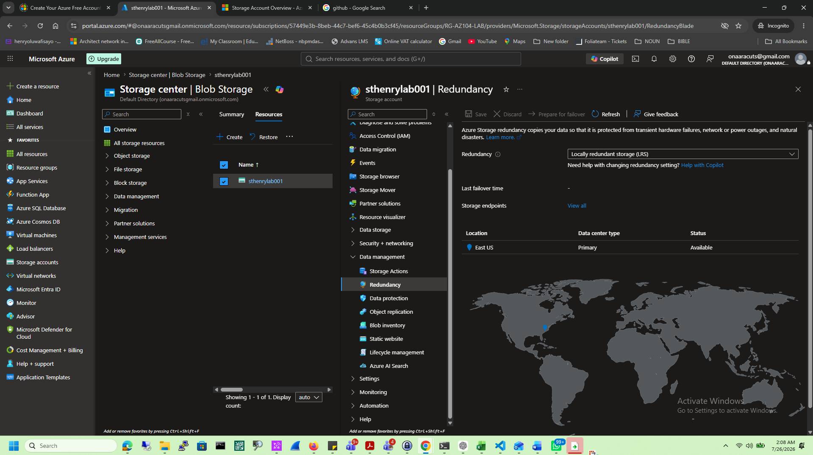

# Azure Storage

## Objective

Learn how Azure Storage provides scalable and secure cloud storage.

## Services Used

- Storage Account
- Blob Storage
- Containers

## Tasks Completed

- Created Storage Account
- Created Blob Container
- Uploaded Files
- Explored Replication

## Lessons Learned

- Storage Accounts host Azure storage services.
- Blob Storage stores unstructured data.
- LRS stores three copies within a single datacenter.
- Azure Storage supports secure access through RBAC, SAS Tokens, and Access Keys.

## Skills Demonstrated

- Azure Storage
- Blob Storage
- Storage Containers
- Cloud File Management

# Screenshots

## Create Storage

---

## Deployment

---

## Overview

---

## Container

---

## Upload

---

## Blob

---

## Replication

