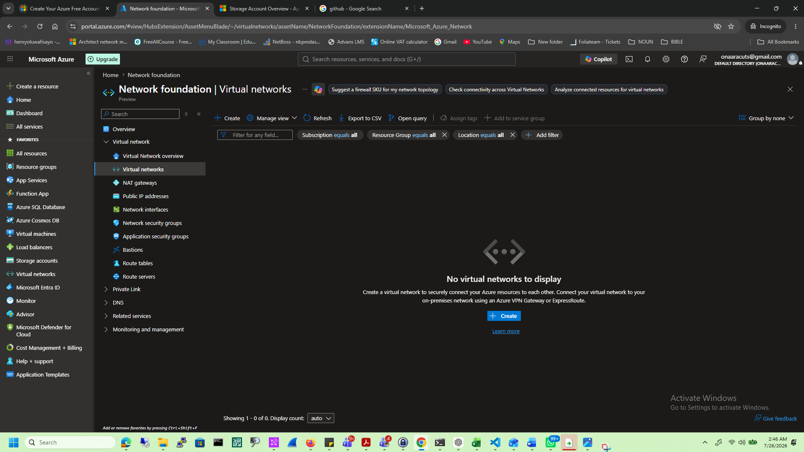
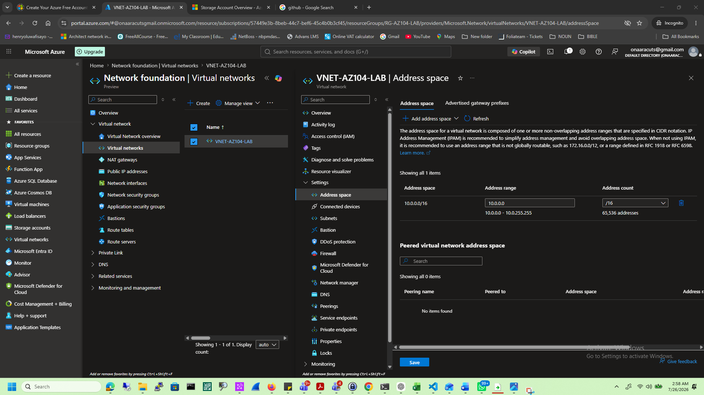
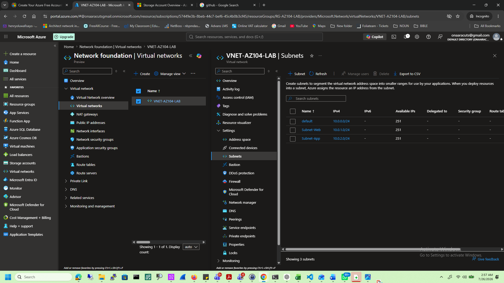
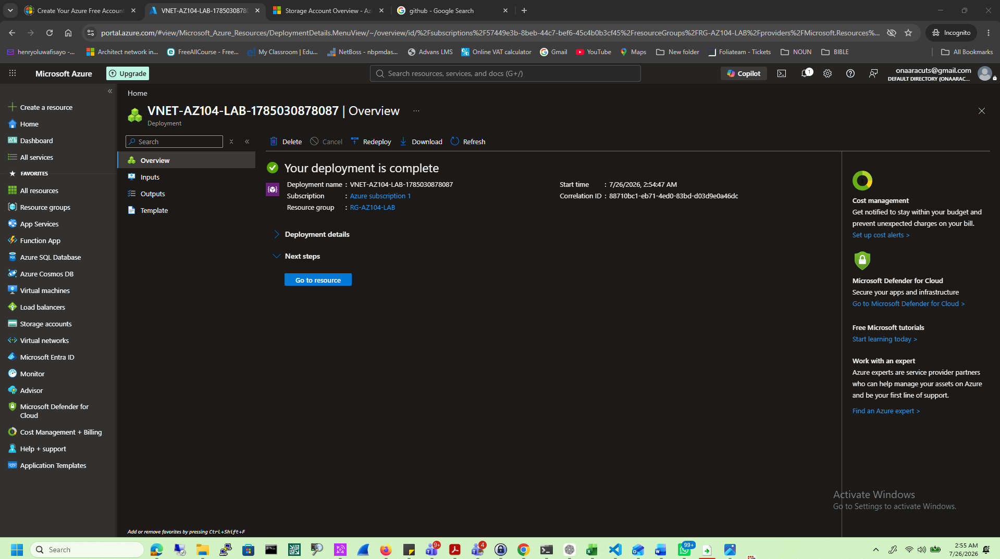
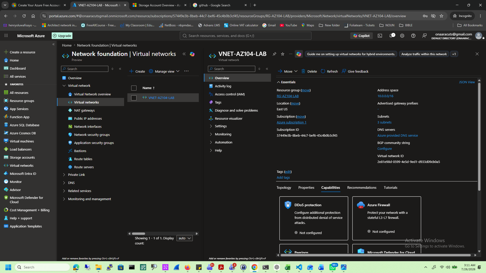

# Azure Virtual Networks

## Objective

Learn how Azure Virtual Networks provide secure communication between Azure resources.

## Services Used

- Azure Virtual Network
- Subnets

## Tasks Completed

- Created a Virtual Network
- Configured Address Space
- Created Web and App Subnets
- Reviewed VNet configuration

## Lessons Learned

- A VNet provides a private network in Azure.
- Subnets divide a VNet into logical network segments.
- Private IP addresses are used for internal communication.
- Proper network segmentation improves security.

## Skills Demonstrated

- Azure Networking
- Virtual Networks
- Subnet Design
- IP Address Planning

# Screenshots

## Create VNets

---

## Address Space

---

## Subnets

---

## Deployment Successful

---

## Overview

