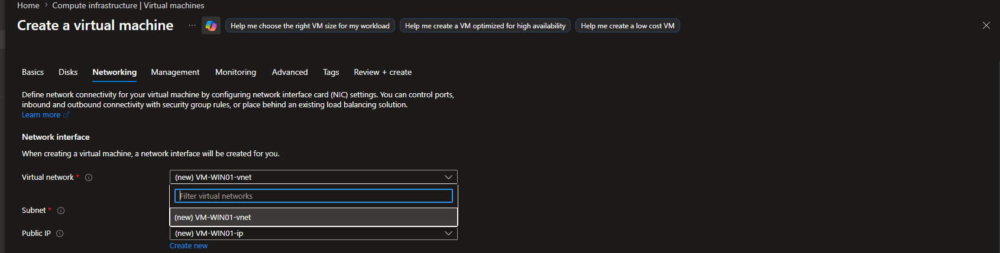
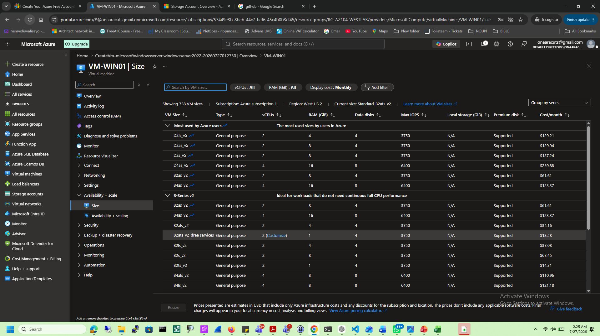
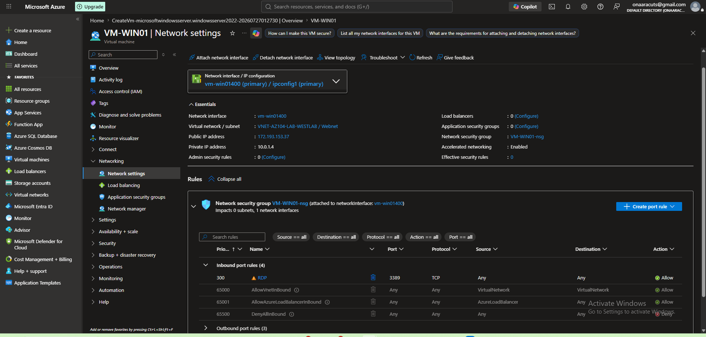
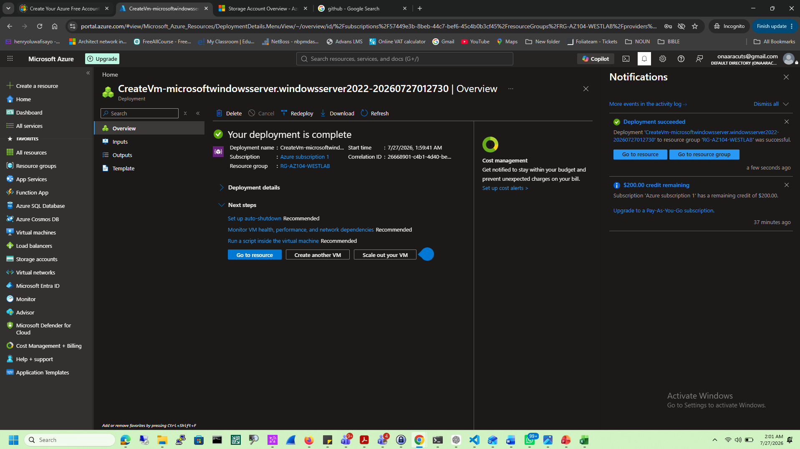
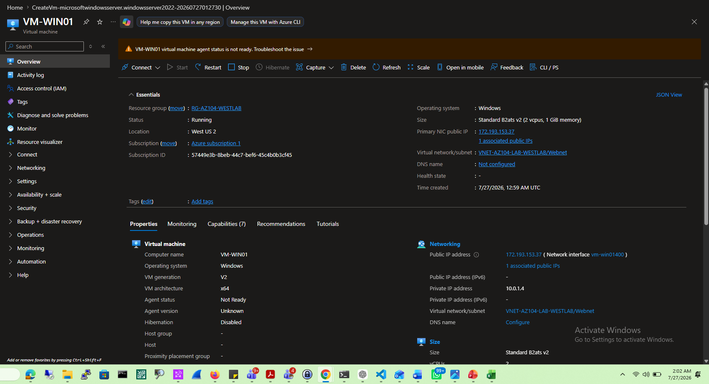
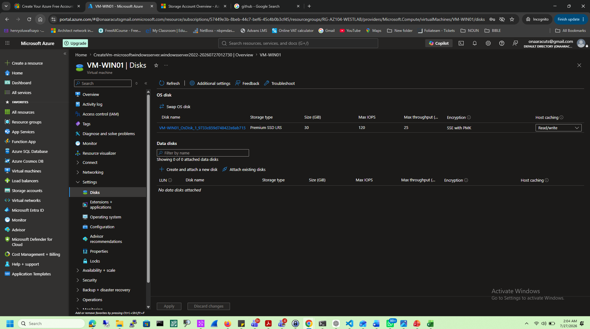
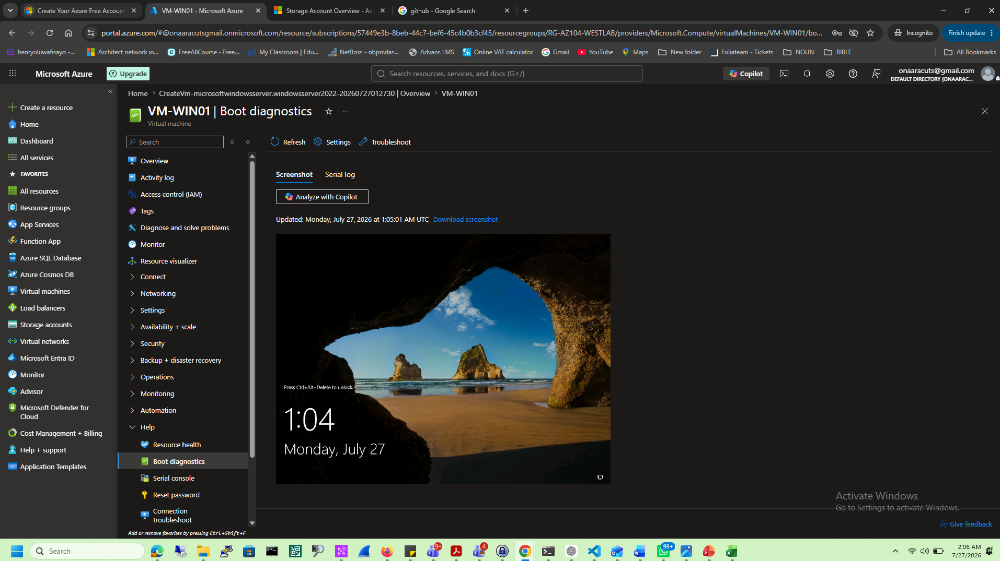
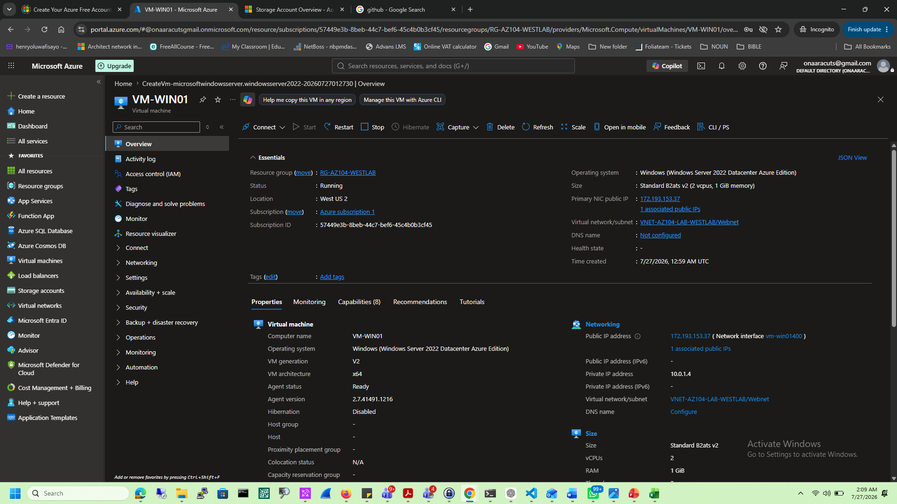
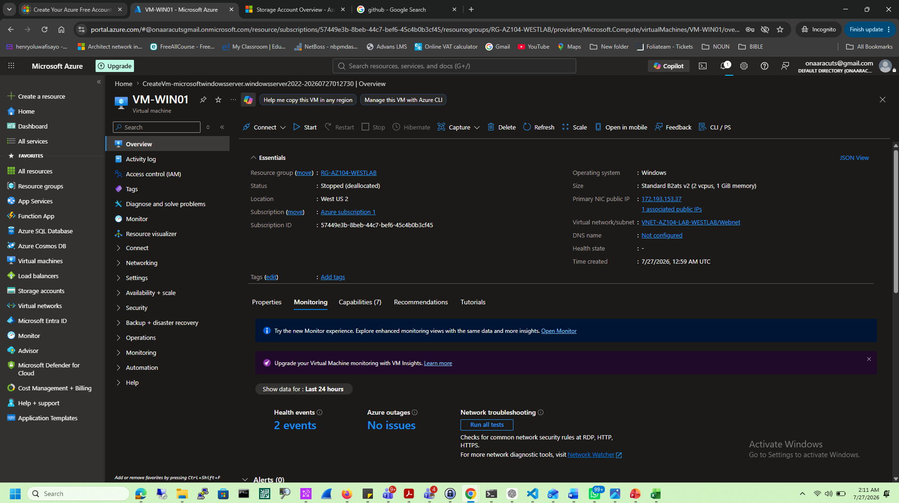

# Azure Virtual Machines

## Objective

Deploy and manage Azure Virtual Machines.

## Services Used

- Azure Virtual Machines
- Azure Managed Disks
- Azure Networking

## Tasks Completed

- Created a Windows Server VM
- Configured networking
- Reviewed boot diagnostics
- Started and stopped the VM

## Lessons Learned

- Azure VMs provide Infrastructure as a Service (IaaS).
- Managed Disks simplify storage management.
- Stopping a VM inside Windows does not stop Azure billing.
- A VM should be deallocated when not in use to reduce costs.

## Skills Demonstrated

- Azure Compute
- Azure Virtual Machines
- Managed Disks
- Azure Networking

## Business Scenario

A company deploys a Windows Server VM to host an internal business application. The server is placed inside a secure Virtual Network, protected with Network Security Groups, and only authorized administrators can access it through RDP.

## Best Practices

- Use the smallest VM size that meets workload requirements.
- Stop and deallocate unused VMs.
- Use Managed Disks.
- Restrict RDP access.
- Enable monitoring and boot diagnostics.

## Interview Questions

1. What is an Azure Virtual Machine?
2. What is the difference between an OS Disk and a Data Disk?
3. Why should you deallocate a VM?
4. What are Managed Disks?
5. When would you use an Availability Zone?

# Screenshots

## Create VM

---

## VM Size

---

## Networking

---

## Deployment Successful

---

## Overview

---

## Disks

---

## Boot Diagnostics

---

## Running

---

## Stopped

