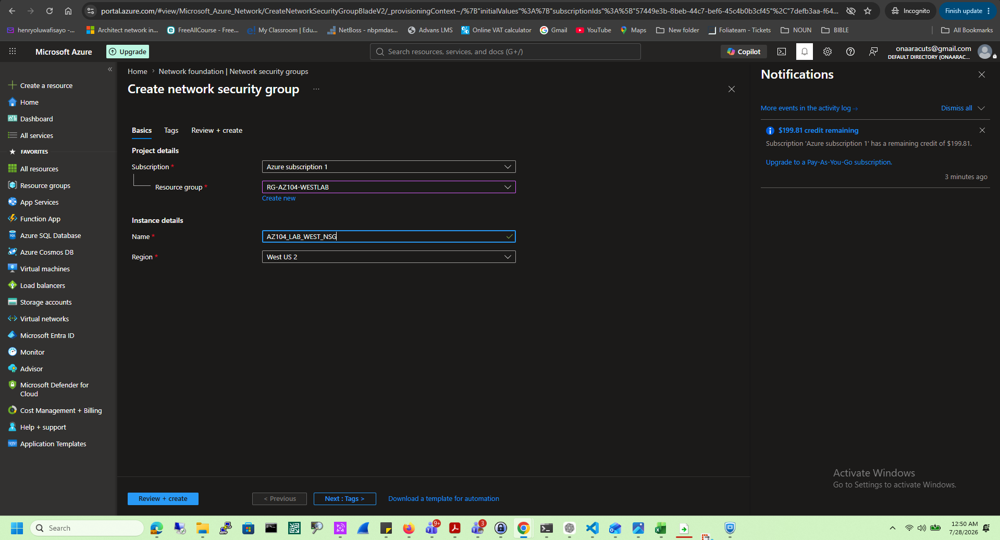
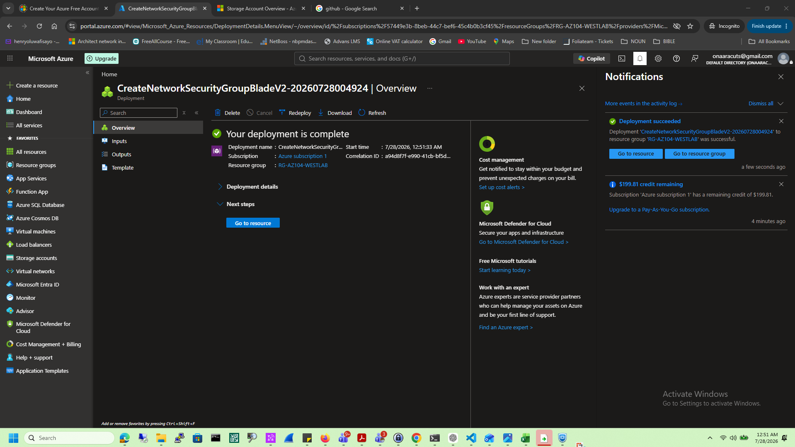
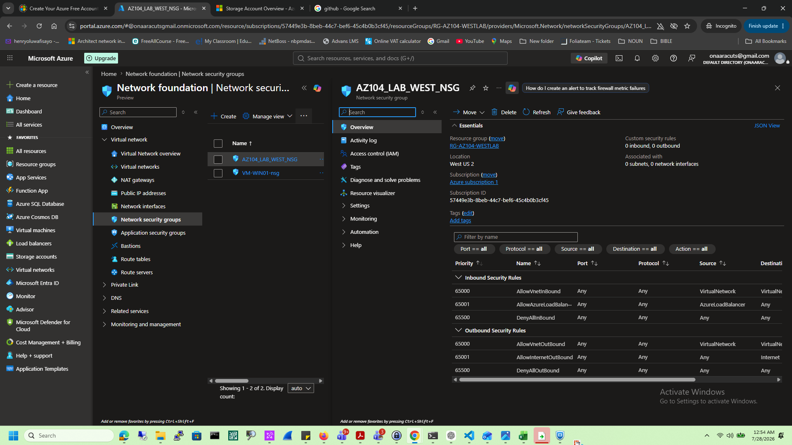
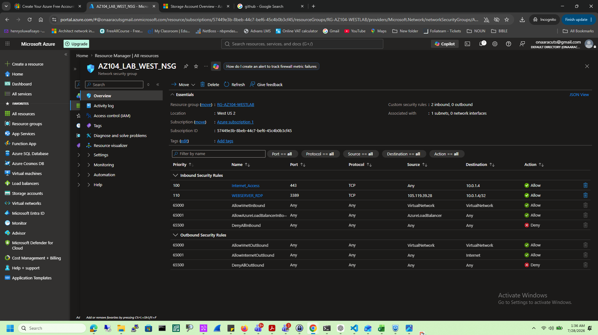
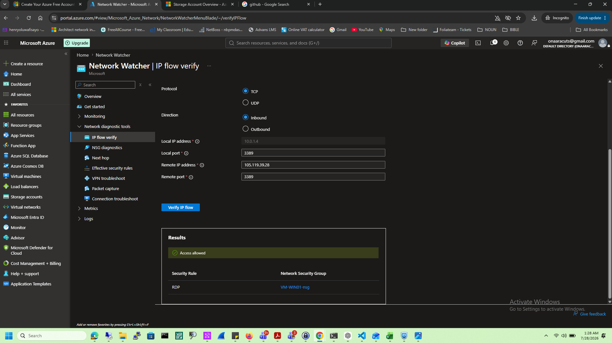
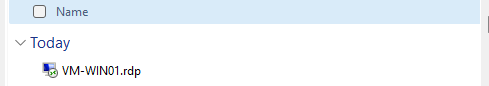
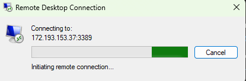
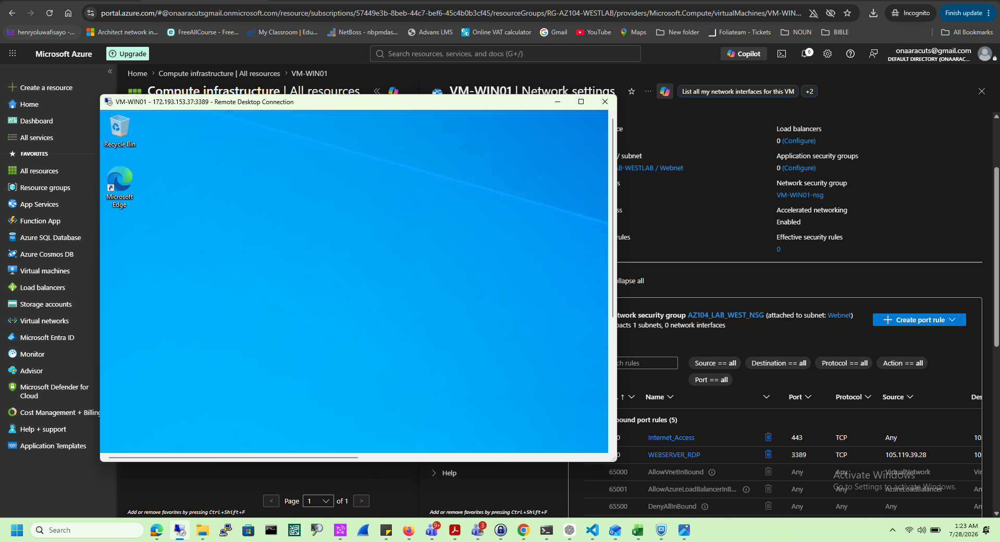
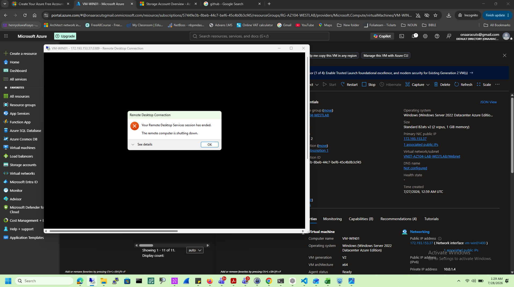

# Network Security Groups

## Objective
- Create a NSG
- Associate the NSG with a subnet
- Verify the rules .

## Services Used

- Azure Virtual Machines
- Azure Network Security Groups 
- RDP Connection File
- local Environment 

## Tasks Completed

- Created NSG
- Associating it to a Subnet
- Rule creation to allow RDP and HTTPS connection 
- Starting a VM
- Verify the NSG
- RDP connection to the VM from unallowed Source
- RDP connection to the VM from allowed Source
- Deallocate the VM

## Lessons Learned

- NSGs is a built-in azure virtual firewall and filter traffic to and from Azure resources base on rules
- NSG can protect VMs, VM NICs, subnets, Application Servers, Database Servers
- Every rule checks Source, Destination, Protocol, Port, Action and Priority
- Azure processes NSG rule from Lowest priority to number with the highest
- Traffic coming into VM is Inbound while traffic leaving the VM are outbound 

## Skills Demonstrated

- Azure Network Security Rule
- Azure Virtual Machines
- Connection to VM

## Business Scenario

A company deploys a Windows Server VM to host an internal business application. The server is placed inside a secure Virtual Network, protected with Network Security Groups, and only authorized administrators can access it through RDP.

## Best Practices

- Always verify your rule
- Azure processes rule from lowest priority number to highest rule

# Screenshots

## Create NSG

---

## NSG Deployment Successful

---

## Default NSGs Overview

---

## NSG Rule 

---

## Verify RDP Rule

---

## RDP CONNECTION FILE

---

## Failed RDP From UNKNOWN SOURCE

---

## RDP Connection Successful

---

## RDP Session Ended

---

