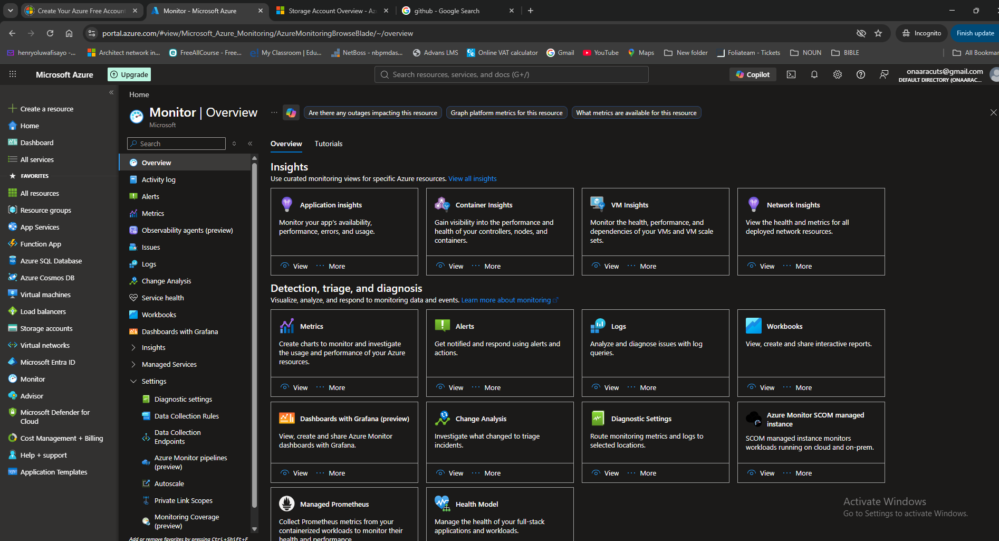
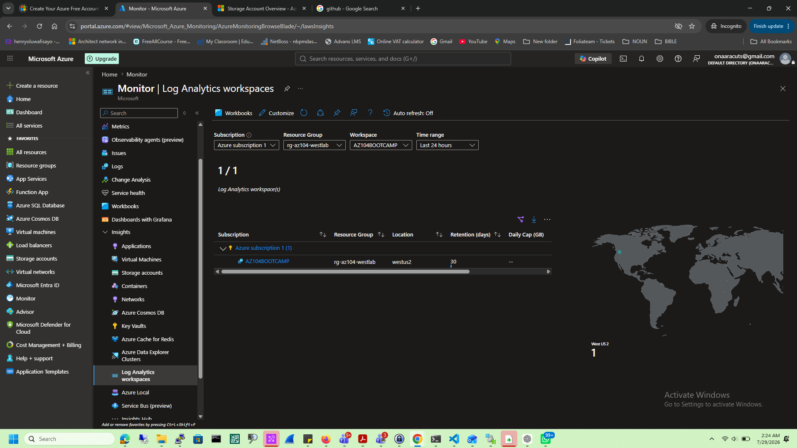
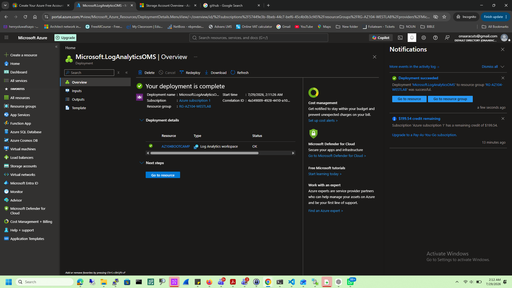
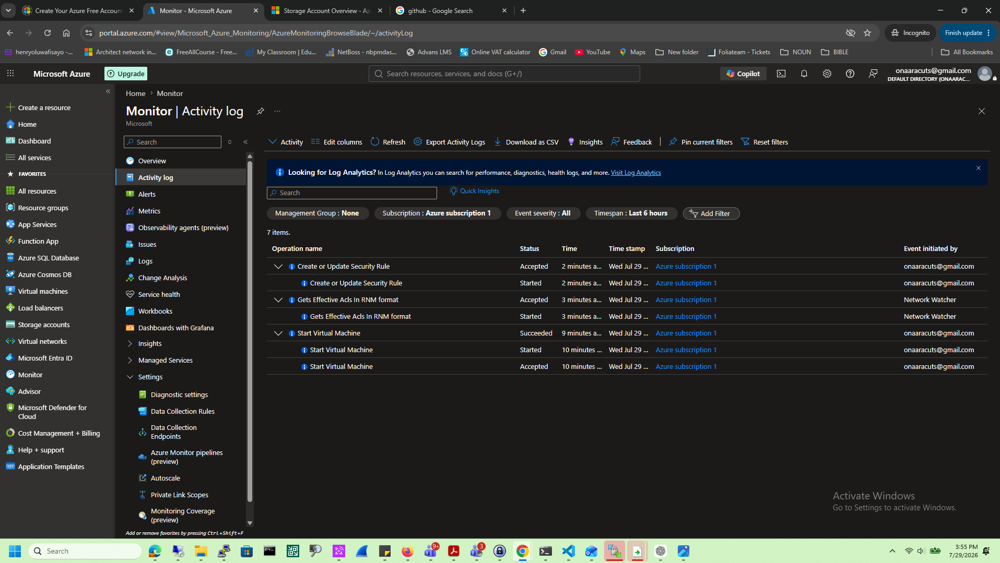
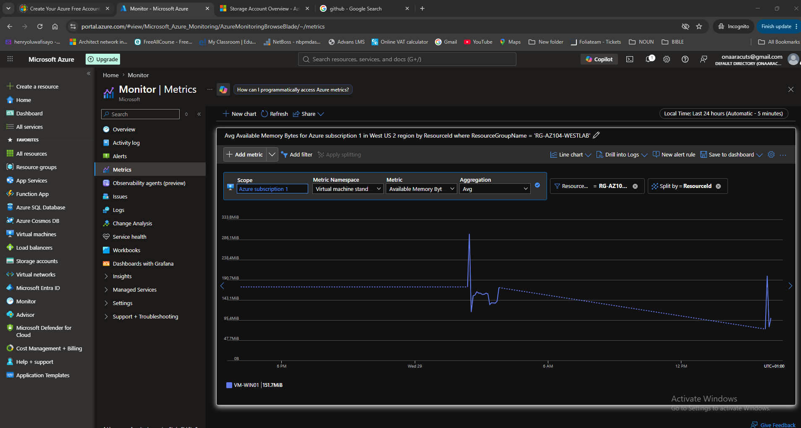
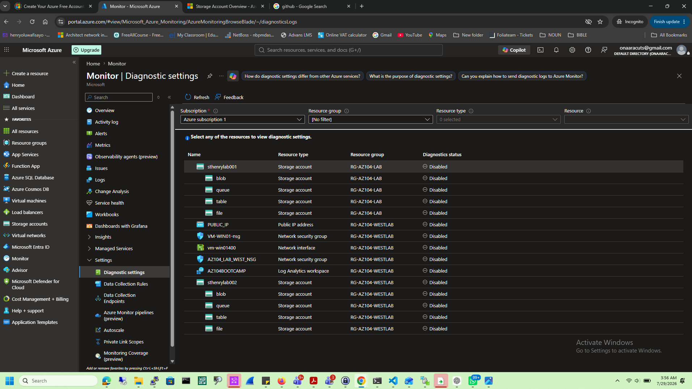
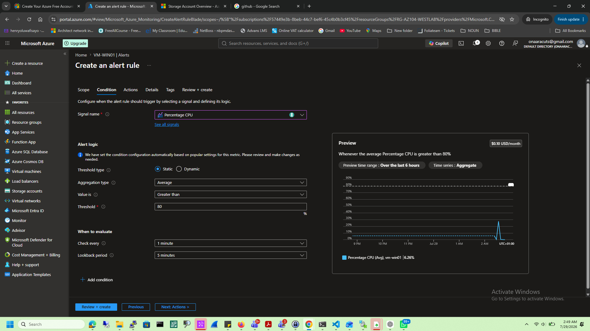
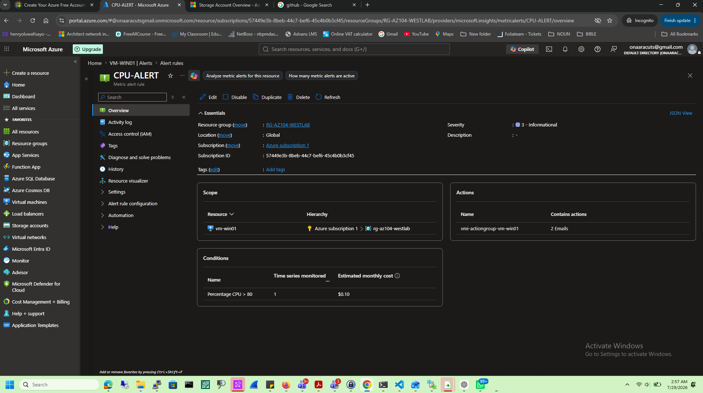
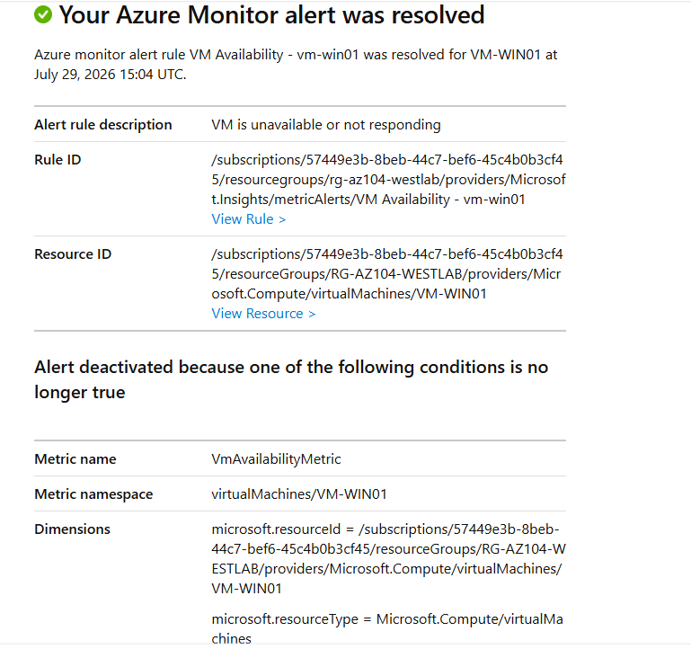

# Azure Monitoring Lab

## Objective

Configure Azure Monitor to proactively monitor Azure Virtual Machines by using Log Analytics Workspace, Azure Monitor Agent, Data Collection Rules, Metrics, Alerts, and Action Groups.

## Technologies Used

- Azure Monitor
- Log Analytics Workspace
- Azure Monitor Agent
- Data Collection Rule
- Azure Alerts
- Action Groups
- Azure Metrics
- Activity Log

## Tasks Completed

- Created a Log Analytics Workspace.
- Connected the virtual machine to Azure Monitor.
- Enabled Azure Monitor Agent.
- Configured a Data Collection Rule.
- Reviewed VM metrics and Activity Logs.
- Created a CPU Alert Rule.
- Configured an Action Group for email notifications.
- Verified the health of the Log Analytics Workspace.

## Business Scenario

As the Azure Administrator for a financial institution, I implemented Azure Monitor to provide centralized monitoring for production virtual machines. By integrating a Log Analytics Workspace, Azure Monitor Agent, and Alert Rules, administrators can proactively detect performance issues, receive automatic notifications, and troubleshoot infrastructure before users experience service interruptions.

## Lessons Learned

- Azure Monitor centralizes monitoring for Azure resources.
- Log Analytics Workspace stores monitoring data for analysis.
- Azure Monitor Agent collects telemetry from virtual machines.
- Data Collection Rules define what telemetry is collected.
- Alert Rules and Action Groups automate notifications based on performance thresholds.

## Skills Demonstrated

- Azure Monitoring
- Log Analytics
- Azure Monitor Agent
- Alert Configuration
- Performance Monitoring
- Infrastructure Health Monitoring

# Screenshots

## Azure Monitor Overview

---

## Log Analytics Overview

---

## Log Analytics Workspaces

---

## Azure Activity Log

---

## Azure Monitor Overview

---

## Metrics

---

## Diagnostics Settings

---

## Create Alert

---

## CPU Alert

---

## Mail Notification

